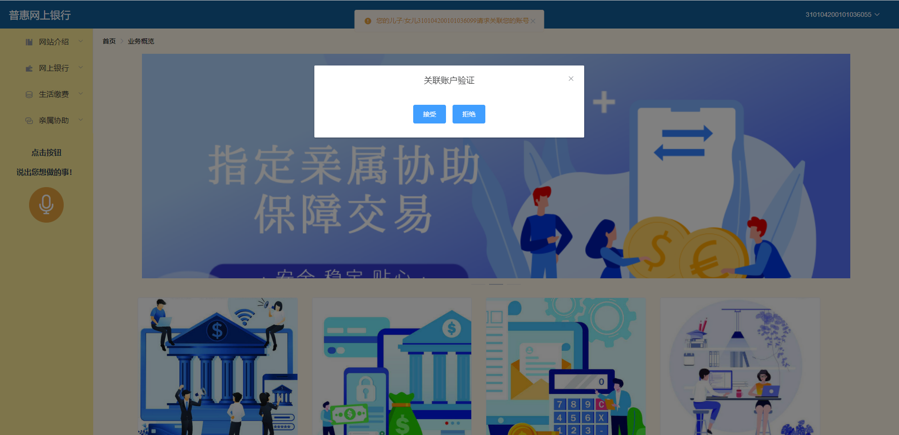

# 普惠网上银行

# 1. 项目主要界面设计

​	本项目在进行界面设计的过程中，充分考虑到本项目普惠金融的特性，在界面设计时对老年用户的使用进行了优化。通过更大的按钮，更简洁的界面，更清晰的业务逻辑，为老年用户的使用提供了较多便利。

## 1.1 登录和注册

### 1.1.1 用户登录

​	用户输入身份证号和密码进行登录。


### 1.1.2 新用户注册

​	用户输入相关信息进行新用户的注册。


### 1.1.3 用户关系注册

​	用户输入希望进行关联账号的对方身份证号。


### 1.1.4 用户关系确认

​	当关联请求从一个用户发出时，正在被关联的用户会接受到通知选择是否接受该关联请求。



​	当用户希望解除账号关联时，可以选择解除关联关系。


## 1.2 核心系统功能

​	用户可以在系统首页浏览并查看自己的账户信息。


### 1.2.1 汇款和存款

​	用户选择本人的交易卡，输入合法金额后验证密码与对方账号进行转账。


### 1.2.2 网上开户

​	用户输入本人身份证号，并输入以及确认密码后，上传有效身份证件进行开户。


### 1.2.3 交易记录查看

​	用户选择自己的账户进行交易记录查看。


## 1.3 公用事业付款

​	用户可以在我们的网上银行进行水电煤气费的缴纳。


### 1.3.1 水费支付

用户输入合法的交易金额，确认户主身份证号，并输入合法的本人账户信息进行缴费。


### 1.3.2 电费支付

用户输入合法的交易金额，确认户主身份证号，并输入合法的本人账户信息进行缴费。


### 1.3.3 煤气费支付

用户输入合法的交易金额，确认户主身份证号，并输入合法的本人账户信息进行缴费。


## 1.4 协助请求(关联账户）

### 1.4.1 发起协助请求

用户可以在我们的网上银行轻松的发起三种类型的亲属帮助，来帮助老年用户完成操作。老年用户只需一键进行审核即可。


#### 1.4.1.1 发起新的生活缴费援助请求

用户在发起生活缴费帮助时，需输入金额、对方身份证号、缴费账户信息并选择缴费类型。在验证通过后即可发起请求。


#### 1.4.1.2 发起新的汇款援助请求

用户在发起汇款帮助时，需输入金额、对方身份证号、转出账户信息以及转入账户信息。在验证通过后即可发起请求。


#### 1.4.1.3 发起新的开户援助请求

用户在发起开户帮助时，需输对方身份证号、输入并确认密码，并上传被开户人的有效身份证图片。在验证通过后即可发起请求。


### 1.4.2 处理亲属发起的援助请求

当用户的亲属发起新的协助请求时，被协助用户都会实时接收到提醒。此时，用户可以选择接受或拒绝该协助操作。用户接受该操作后，该操作所涉及的所有交易才会真正进行。若用户拒绝该操作，则不会执行任何交易逻辑，该条请求作废。


### 1.4.3 查看亲属发起的所有援助请求

用户可以查看到所有发生过的亲属援助请求。


## 1.5 语音助手

### 1.5.1 语音助手实现功能无障碍跳转(语音助手按钮一键实现）

用户只需点击语音服务助手按钮即可一键唤醒智能语音服务，并通过简单的语音指令控制我们的网上银行进行操作。


### 1.5.2 语音助手实现无障碍输入(语音助手按钮一键实现）

用户只需点击语音服务助手按钮即可一键唤醒智能语音服务，并通过简单的语音指令进行输入。


## 2 项目代码结构

```bash
项目后端主要文件结构：
├───src
│   ├───main
│   │   ├───java
│   │   │   └───com
│   │   │       └───banking
│   │   │           └───projectserver
│   │   │               ├───activeMQ（消息队列服务）
│   │   │               ├───aop（面向切面的接口日志服务）
│   │   │               │   ├───aspect
│   │   │               │   ├───log
│   │   │               │   └───manager
│   │   │               ├───config（项目后端网络配置）
│   │   │               ├───controller（控制器层）
│   │   │               ├───entity（实体类型定义）
│   │   │               ├───ExceptionHandler（统一异常封装）
│   │   │               ├───mapper（数据库查询层）
│   │   │               ├───response（统一请求封装）
│   │   │               ├───service（业务逻辑接口层）
│   │   │               ├───serviceImpl（业务逻辑实现层）
│   │   │               └───util（工具函数：如加密传输等）
│   │   └───resources
│   └───test（测试文件）
│       └───java
│           └───com
│               └───banking
│                   └───projectserver
│                       ├───activeMQ（消息队列测试）
│                       ├───controller（控制器层测试）
│                       ├───mapper（数据库查询层测试）
│                       ├───service（业务逻辑接口层测试）
│                       └───serviceImpl（业务逻辑实现层测试）
└───target
    ├─......
    ......

项目前端主要文件结构：
├───assets（网页资源：如图片或矢量图素材等）
├───components（各个模块的前端页面）
│   ├───assistanceFunction（亲属协助功能界面）
│   ├───backStageManagement（管理员界面-待部署）
│   ├───conciergeService（礼宾服务界面-该功能已废除）
│   ├───coreFunction（核心银行业务界面）
│   ├───loginFunction（登录服务界面）
│   └───utilityFunction（公共事务缴费界面）
├───router（路由配置文件）
├───store（浏览器缓存配置）
└───utils（工具函数：如加密传输等）
```

